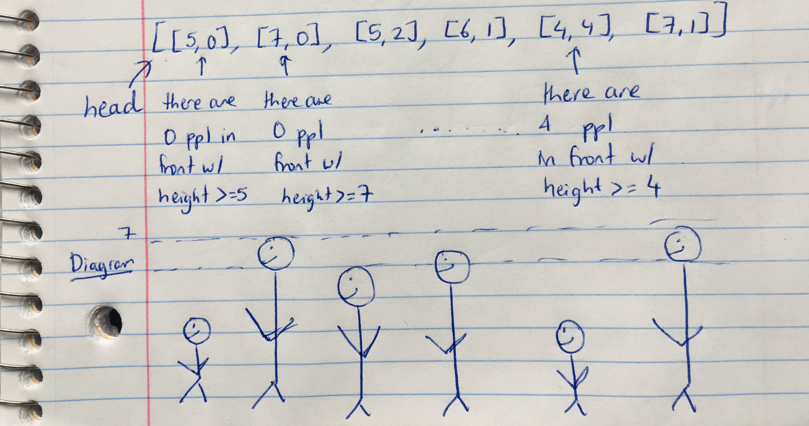

# Queue Reconstruction by Height

Suppose you have a random list of people standing in a queue. Each person is described by a pair of integers`(h, k)`, where`h`is the height of the person and`k`is the number of people in front of this person who have a height greater than or equal to`h`. Write an algorithm to reconstruct the queue.

**Note:**  
The number of people is less than 1,100.

**Example**

```text
Input:[[7,0], [4,4], [7,1], [5,0], [6,1], [5,2]]Output:[[5,0], [7,0], [5,2], [6,1], [4,4], [7,1]]
```

分析：

先按身高倒序，index正序排序，override comparator class's function compare。然后每次按照index插入array。当前已有的元素则后退。最后用 ret.toArray\(new int\[0\]\)返回结果。



答案：

```text
    public int[][] reconstructQueue(int[][] people) {        if (people == null || people.length == 0 || people[0].length == 0)            return new int[0][0];        int[][] ret = new int[people.length][people[0].length];        Arrays.sort(people, new Comparator<int[]>(){            public int compare(int[] a, int[] b){                if(a[0] == b[0]){                    return a[1] - b[1];                }                return b[0] - a[0];            }        });        List<int[]> temp = new ArrayList<int[]>();        for(int[] p : people){            temp.add(p[1], p);//按照Index插入 把上一次该位置的数挤到后面        }        return temp.toArray(new int[0][0]);//可以直接用index 0 也可以用实际length    }
```

