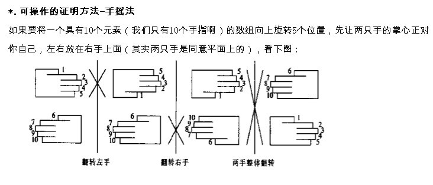

# Reverse Words in a String

Given an input string, reverse the string word by word.

For example,  
Given s = "`the sky is blue`",  
return "`blue is sky the`".

分析

三步翻转法，先整体翻转，然后每个单词翻转。整体翻转不用trim也不用跳过空格。

split方法



答案

```text
public class Solution {
    public String reverseWords(String s) {
        if(s == null || s.trim().length() == 0)
            return s.trim();
        String[] temp =helper(s).split(" ");//整体翻转不用trim
        String sentence = "";
        for(String t : temp){
            if(t.trim().equals(""))
                continue;
            sentence += helper(t) + " ";
        }
        return sentence.trim();
    }

    //不用去除空格
    private String helper(String s){
        char[] cs = s.trim().toCharArray();
        int ss = 0, e = cs.length - 1;
        while(ss < e){           
                char temp = cs[ss];
                cs[ss] = cs[e];
                cs[e] = temp;
                ss ++;
                e --;


        }
        return new String(cs);
    }
}
```

