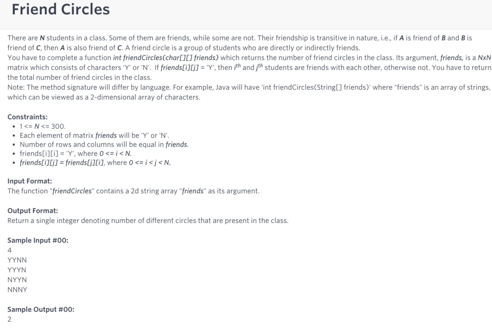

# Friend Circle

分析

并查集，比较number of island，这里是两两关系会有重复，不能四个方向伸展，不像island，都是独立的点。

这里total /= 2;

```text
import java.io.IOException;class UnionFind{    private int[] father = null;    private int count;    public UnionFind(int n){        father = new int[n];        for(int i = 0; i < n; i ++){            father[i] = i;        }    }    private int find(int x){        if(father[x] == x)            return x;        return father[x] = find(father[x]);    }    public void connect(int x, int y){        int root_x = find(x);        int root_y = find(y);        if(root_x != root_y){            father[root_x] = root_y;            count --;        }    }    public int query(){        return count;    }    public void set_count(int total){        count = total;    }}public class Solution {    int n, m;    public int friendCircles(String[] friends){        if(friends == null || friends.length == 0 || friends[0] == null || friends[0].length() == 0)            return 0;        n = friends.length;        m = friends[0].length();        UnionFind uf = new UnionFind(n*m);        int total = 0;        for(int i = 0; i < n; i ++){            for(int j = 0; j < m; j ++){                if(friends[i].charAt(j) == 'Y'){                    total ++;  //一个点不能connect,只能计算total这里                }            }        }        total /= 2;        uf.set_count(total);        for(int i = 0; i < n; i ++){            for(int j = 0; j < m; j ++){                if(friends[i].charAt(j) == 'Y'){                  uf.connect(i, j);                }            }        }        return uf.query();    }    public static void main(String[] args) throws IOException {        Solution s  = new Solution();        String[] src = {"YYNN", "YYYN", "NYYN", "NNNY"};        int ret = s.friendCircles(src);        System.out.println(ret);    }}
```

